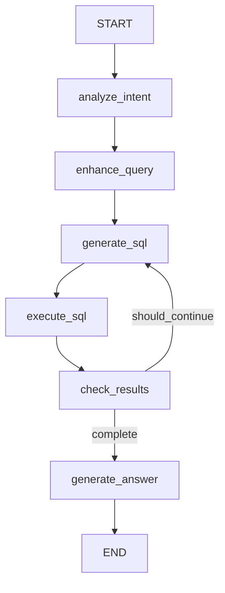

# LangGraph 架构重构总结

## 概述

本次重构将 Sight Server 的 SQL查询Agent 从简化的两步流程升级为基于 **LangGraph** 的多步迭代查询架构，实现了模块化设计和单一职责原则。

## 架构变更

### 重构前（简化模式）

```
SQLQueryAgent (monolithic)
├─ _generate_sql()
├─ _execute_sql_and_format()
├─ _generate_answer()
└─ run() / run_with_thought_chain()
```

**问题:**
- 所有逻辑集中在一个类中（450+行）
- 缺少模块化和代码复用
- 不支持多步迭代查询
- 难以扩展和维护

### 重构后（LangGraph模式）

```
sight_server/core/
├── schemas.py              # 数据模型定义
├── processors/             # 处理器组件
│   ├── sql_generator.py    # SQL生成器
│   ├── sql_executor.py     # SQL执行器
│   ├── result_parser.py    # 结果解析器
│   └── answer_generator.py # 答案生成器
├── graph/                  # LangGraph工作流
│   ├── nodes.py            # 节点函数
│   ├── edges.py            # 条件边
│   └── builder.py          # 图构建器
└── agent.py                # 主Agent（简化）
```

**优势:**
- 清晰的模块化架构
- 单一职责原则
- 支持多步迭代查询（最多3次）
- 易于测试和扩展
- 完整的思维链记录

## 核心组件

### 1. 数据模型 (`core/schemas.py`)

#### QueryResult
```python
class QueryResult(BaseModel):
    status: str              # success/error
    answer: str              # 自然语言回答
    data: List[Dict]         # 查询结果数据
    count: int               # 结果数量
    message: str             # 消息
    sql: Optional[str]       # 执行的SQL
```

#### AgentState
```python
class AgentState(TypedDict):
    # 输入
    query: str
    enhanced_query: str

    # 多步累积（使用 Annotated[List, add]）
    sql_history: Annotated[List[str], add]
    execution_results: Annotated[List[Dict], add]
    thought_chain: Annotated[List[Dict], add]

    # 当前状态
    current_step: int
    current_sql: Optional[str]
    current_result: Optional[Dict]

    # 控制流
    should_continue: bool
    max_iterations: int
    error: Optional[str]

    # 输出
    final_data: List[Dict]
    answer: str
    status: str
```

### 2. 处理器组件 (`core/processors/`)

#### SQLGenerator
**职责:** 生成SQL查询
- `generate_initial_sql(query)` - 生成初始SQL
- `generate_followup_sql(...)` - 生成补充查询
- `analyze_missing_info(...)` - 分析缺失字段

#### SQLExecutor
**职责:** 执行SQL查询
- `execute(sql)` - 执行SQL并返回结果
- `_parse_result(raw_result)` - 解析多种结果格式
- `validate_sql(sql)` - SQL安全验证

#### ResultParser
**职责:** 解析和合并结果
- `merge_results(results)` - 合并多步查询结果
- `evaluate_completeness(data)` - 评估数据完整性
- `deduplicate(data)` - 数据去重
- `filter_by_quality(data)` - 质量过滤

#### AnswerGenerator
**职责:** 生成自然语言回答
- `generate(query, data, count)` - 生成回答
- `_detect_query_type(query)` - 检测查询类型
- `_generate_statistical_answer(...)` - 统计类回答
- `_generate_detail_answer(...)` - 详情类回答

### 3. LangGraph工作流 (`core/graph/`)

#### 工作流结构



#### 节点函数 (nodes.py)

1. **analyze_intent** - 分析查询意图
   - 使用 PromptManager.analyze_query_intent()
   - 判断是否需要空间查询
   - 初始化控制变量

2. **enhance_query** - 增强查询文本
   - 添加空间查询提示（如需要）
   - 丰富查询上下文

3. **generate_sql** - 生成SQL查询
   - 首次查询：调用 sql_generator.generate_initial_sql()
   - 后续查询：调用 sql_generator.generate_followup_sql()

4. **execute_sql** - 执行SQL
   - 调用 sql_executor.execute()
   - 合并多步查询结果（如有）

5. **check_results** - 检查结果完整性
   - 调用 result_parser.evaluate_completeness()
   - 决定是否继续查询

6. **generate_answer** - 生成最终答案
   - 调用 answer_generator.generate()
   - 设置最终状态

#### 条件边 (edges.py)

```python
def should_continue_querying(state: AgentState) -> Literal["generate_sql", "generate_answer"]:
    """
    决策逻辑:
    1. 有错误 → 结束
    2. 达到最大迭代次数 → 结束
    3. should_continue=False → 结束
    4. 否则 → 继续生成SQL
    """
```

#### 图构建器 (builder.py)

```python
class GraphBuilder:
    @staticmethod
    def build(nodes: AgentNodes):
        workflow = StateGraph(AgentState)

        # 添加节点
        workflow.add_node("analyze_intent", nodes.analyze_intent)
        workflow.add_node("enhance_query", nodes.enhance_query)
        # ... 其他节点

        # 设置入口
        workflow.set_entry_point("analyze_intent")

        # 添加边
        workflow.add_edge("analyze_intent", "enhance_query")
        # ... 其他边

        # 条件边（循环控制）
        workflow.add_conditional_edges(
            "check_results",
            should_continue_querying,
            {
                "generate_sql": "generate_sql",
                "generate_answer": "generate_answer"
            }
        )

        return workflow.compile()
```

### 4. 主Agent (`core/agent.py`)

**简化为组合和编排:**

```python
class SQLQueryAgent:
    def __init__(self, ...):
        # 初始化核心组件
        self.db_connector = DatabaseConnector()
        self.llm = BaseLLM()

        # 初始化处理器
        self.sql_generator = SQLGenerator(self.llm, base_prompt)
        self.sql_executor = SQLExecutor(self.db_connector)
        self.result_parser = ResultParser()
        self.answer_generator = AnswerGenerator(self.llm)

        # 构建LangGraph工作流
        self.agent_nodes = AgentNodes(...)
        self.graph = GraphBuilder.build(self.agent_nodes)

    def run(self, query: str) -> str:
        # 初始化状态
        initial_state = {...}

        # 执行LangGraph工作流
        result_state = self.graph.invoke(initial_state)

        # 构建QueryResult
        query_result = QueryResult(**result_state)
        return query_result.model_dump_json()
```

## 多步查询流程

### 示例：查询缺失详细信息的景区

```
第1步：生成初始SQL
├─ 查询 a_sight 表获取基础信息
└─ LEFT JOIN tourist_spot 获取详情

第2步：检查结果
├─ 发现部分记录缺少"评分"、"门票"等字段
└─ should_continue = True

第3步：生成补充SQL
├─ 针对缺失字段生成补充查询
└─ 重点获取缺失的详细信息

第4步：执行补充SQL
└─ 合并结果（使用 result_parser.merge_results）

第5步：再次检查
├─ 数据完整度 >= 90%
└─ should_continue = False

第6步：生成答案
└─ 返回完整结果
```

## 状态累积机制

使用 `Annotated[List, add]` 实现历史累加：

```python
# 定义
sql_history: Annotated[List[str], add]

# 更新（LangGraph自动处理）
return {
    "sql_history": [new_sql]  # 自动追加到现有列表
}

# 结果
state["sql_history"] = [sql1, sql2, sql3]  # 所有SQL历史
```

## API兼容性

重构保持了向后兼容：

```python
# ✅ 原有API继续工作
agent = SQLQueryAgent()
result = agent.run("查询浙江省的5A景区")  # 返回JSON字符串
thought_chain = agent.run_with_thought_chain("...")  # 返回思维链

# ✅ 新增功能
# - 自动多步查询
# - 完整的思维链记录
# - 更丰富的元数据
```

## 文件结构对比

### 重构前
```
core/
├── llm.py
├── database.py
├── prompts.py
├── agent.py (450+ lines, monolithic)
└── __init__.py
```

### 重构后
```
core/
├── llm.py
├── database.py
├── prompts.py
├── schemas.py              # ✨ NEW
├── processors/             # ✨ NEW
│   ├── __init__.py
│   ├── sql_generator.py
│   ├── sql_executor.py
│   ├── result_parser.py
│   └── answer_generator.py
├── graph/                  # ✨ NEW
│   ├── __init__.py
│   ├── nodes.py
│   ├── edges.py
│   └── builder.py
├── agent.py (简化至 ~350 lines)
└── __init__.py (更新导出)
```

## 优化点总结

### 1. 架构层面
- ✅ 模块化设计（7个新文件）
- ✅ 单一职责原则（每个类一个职责）
- ✅ 组合优于继承
- ✅ 依赖注入模式

### 2. 功能层面
- ✅ 多步迭代查询（最多3次）
- ✅ 智能补充缺失信息
- ✅ 完整的思维链记录
- ✅ 结果质量评估

### 3. 可维护性
- ✅ 清晰的文件组织
- ✅ 详尽的代码注释
- ✅ 独立的测试代码
- ✅ 易于扩展

### 4. 向后兼容
- ✅ 保留所有原有API
- ✅ 保留兼容性方法
- ✅ 无需修改调用代码

## 使用示例

### 基础查询
```python
from core import SQLQueryAgent

agent = SQLQueryAgent(enable_spatial=True)

# 执行查询
result_json = agent.run("查询浙江省的5A景区")

# 解析结果
import json
result = json.loads(result_json)
print(f"Status: {result['status']}")
print(f"Count: {result['count']}")
print(f"Answer: {result['answer']}")
```

### 带思维链的查询
```python
# 获取完整的执行过程
result = agent.run_with_thought_chain("统计杭州市有多少个4A景区")

print(f"Final answer: {result['final_answer']}")
print(f"Step count: {result['step_count']}")
print(f"SQL queries: {len(result['sql_queries_with_results'])}")

# 查看思维链
for step in result['thought_chain']:
    print(f"Step {step['step']}: {step['type']} - {step['status']}")
```

## 下一步工作

- [ ] 添加单元测试
- [ ] 性能优化（缓存、并行）
- [ ] 添加更多查询策略
- [ ] 可视化工作流图
- [ ] 监控和日志增强

## 总结

本次重构成功实现了：

1. **模块化架构** - 从单一类450行拆分为7个专用模块
2. **LangGraph集成** - 实现了多步迭代查询工作流
3. **单一职责** - 每个组件只负责一个明确的功能
4. **向后兼容** - 保持了所有原有API不变
5. **可扩展性** - 便于添加新的节点、处理器和查询策略

架构质量显著提升，为后续功能扩展打下了坚实基础。
