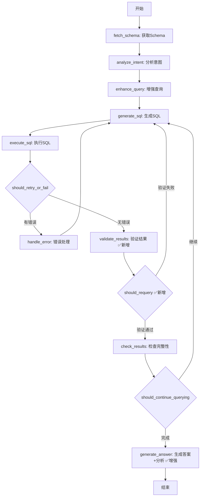

# Agent 结果验证和深度分析功能实施总结

**实施日期**: 2025-10-04
**功能版本**: v2.1.0
**实施状态**: ✅ 已完成

---

## 📋 功能概述

本次更新为 Sight Server 添加了两大核心功能：

1. **智能结果验证**：使用 LLM 验证查询结果是否符合用户需求，并支持自动重新查询
2. **深度数据分析**：对查询结果进行智能分析，提供洞察和建议（不限于 summary 类型）

---

## 🎯 核心特性

### 1. 智能结果验证 (Result Validation)

#### 功能描述
- 使用 LLM 检查查询结果的完整性、准确性和相关性
- 自动识别缺失字段、数据错误等问题
- 携带验证反馈自动重新生成改进的 SQL
- 支持重试次数控制，避免无限循环

#### 验证维度
- **完整性检查**：是否包含必要字段
- **空间数据检查**：坐标信息是否完整有效
- **数据质量检查**：数据是否准确合理
- **相关性检查**：结果是否与用户问题相关

#### 验证流程
```
execute_sql → validate_results → [验证结果]
                                 ├─ ✅ 通过 → check_results
                                 └─ ❌ 失败 → generate_sql (携带反馈重新生成)
```

### 2. 深度数据分析 (Data Analysis)

#### 功能描述
- 所有查询类型（query/summary）都进行智能分析
- 提供数据洞察、模式识别、趋势分析
- 生成关键洞察列表（3-5条）
- 给出相关建议（可选）

#### 分析类型
- **statistical**: 统计分析（计数、汇总、比例等）
- **spatial**: 空间分析（分布、聚集、方位等）
- **trend**: 趋势分析（变化、对比、排名等）
- **general**: 综合分析

#### 输出内容
1. **answer**: 简洁的自然语言回答（1-3句）
2. **analysis**: 深度分析内容（2-4段）
3. **insights**: 关键洞察列表
4. **suggestions**: 相关建议（可选）

---

## 📂 实施文件清单

### ✅ 核心模块（已修改）

#### 1. **core/schemas.py**
- 添加验证相关字段：
  - `validation_history`: 验证历史记录
  - `validation_retry_count`: 验证重试次数
  - `max_validation_retries`: 最大重试次数（默认3）
  - `validation_feedback`: 验证反馈信息
  - `is_validation_enabled`: 是否启用验证
  - `should_return_data`: 是否返回完整数据
- 添加分析相关字段：
  - `analysis`: 深度分析内容
  - `insights`: 关键洞察列表
  - `suggestions`: 相关建议
  - `analysis_type`: 分析类型

#### 2. **core/processors/result_validator.py** (新增)
- `ResultValidator` 类：结果验证器
- `ValidationResult` 模型：验证结果结构
- 主要方法：
  - `validate()`: 验证查询结果
  - `_build_validation_prompt()`: 构建验证提示词
  - `is_enabled()`: 检查是否启用
  - `should_retry()`: 判断是否需要重试

#### 3. **core/processors/data_analyzer.py** (新增)
- `DataAnalyzer` 类：数据分析器
- `AnswerAnalysisResult` 模型：分析结果结构
- 主要方法：
  - `analyze()`: 分析查询结果
  - `_build_analysis_prompt()`: 构建分析提示词
  - `_generate_fallback_answer()`: 生成后备答案
  - `should_analyze()`: 判断是否需要分析

#### 4. **core/graph/nodes.py**
- 新增 `validate_results` 节点（节点5）
  - 验证查询结果
  - 记录验证历史
  - 设置验证反馈
- 增强 `generate_answer` 节点（节点7）
  - 使用 DataAnalyzer 进行深度分析
  - 返回 analysis, insights, suggestions 字段
- 增强 `generate_sql` 节点（节点3）
  - 优先处理验证反馈
  - 调用 `regenerate_with_feedback()` 方法
  - 增加验证重试计数
- 更新节点编号：
  - validate_results: 节点5 ✅ 新增
  - check_results: 节点6 (原节点5)
  - generate_answer: 节点7 (原节点6)
  - handle_error: 节点8 (原节点7)

#### 5. **core/graph/edges.py**
- 修改 `should_retry_or_fail`：
  - 返回类型改为 `"validate_results"` (原 `"check_results"`)
- 修改 `should_continue_querying`：
  - 返回类型改为 `"generate_answer"` (原 `"validate_results"`)
- 新增 `should_requery` 条件边 ✅
  - 判断验证结果是否通过
  - 验证通过 → `"check_results"`
  - 验证失败 → `"generate_sql"` (重新查询)
  - 重试次数用尽 → `"check_results"` (停止重试)

#### 6. **core/graph/builder.py**
- 更新工作流结构：
  ```
  execute_sql → [should_retry_or_fail]
                ├─ handle_error → generate_sql (错误重试)
                └─ validate_results → [should_requery]  ✅ 新增
                                     ├─ generate_sql (验证失败，重新查询)
                                     └─ check_results → [should_continue_querying]
                                                        ├─ generate_sql (继续迭代)
                                                        └─ generate_answer (结束)
  ```
- 添加 validate_results 节点
- 添加 should_requery 条件边

#### 7. **core/processors/sql_generator.py**
- 新增 `regenerate_with_feedback()` 方法 ✅
  - 基于验证反馈重新生成 SQL
  - 分析反馈中的问题和建议
  - 应用改进策略
  - 验证 SQL 结构

#### 8. **models/api_models.py**
- 更新 `QueryResponse` 模型：
  - 新增 `analysis`: 深度分析内容
  - 新增 `insights`: 关键洞察列表
  - 新增 `suggestions`: 相关建议列表
  - 新增 `analysis_type`: 分析类型
  - 新增 `validation_info`: 验证信息
- 更新示例数据

#### 9. **config.py**
- 新增验证配置：
  - `ENABLE_RESULT_VALIDATION`: 是否启用验证（默认 True）
  - `MAX_VALIDATION_RETRIES`: 最大重试次数（默认 3）
- 新增分析配置：
  - `ENABLE_ANSWER_ANALYSIS`: 是否启用分析（默认 True）
  - `ANALYSIS_DETAIL_LEVEL`: 分析详细程度（默认 "detailed"）
- 更新 `get_agent_config()` 方法
- 更新配置打印函数

---

## 🔄 工作流程图

### 完整工作流



### 验证重试流程

```
1. execute_sql 执行查询
2. validate_results 验证结果
   ├─ 检查数据完整性
   ├─ 检查坐标信息（空间查询）
   ├─ 检查数据质量
   └─ 检查相关性
3. 验证结果处理
   ├─ ✅ 通过 → 继续 check_results
   └─ ❌ 失败
       ├─ 构建反馈：问题 + 建议
       ├─ 设置 validation_feedback
       ├─ 重试次数 +1
       └─ 返回 generate_sql
4. generate_sql 处理反馈
   ├─ 检测到 validation_feedback
   ├─ 调用 regenerate_with_feedback()
   ├─ 分析反馈，改进 SQL
   ├─ 清除 validation_feedback
   └─ 返回新 SQL
5. 重复 1-4 直到验证通过或达到重试上限
```

---

## 📊 API 响应示例

### 修改前（基础版）
```json
{
  "status": "success",
  "answer": "武汉市共有56个景区",
  "data": [{"count": 56}],
  "count": 1,
  "message": "查询成功"
}
```

### 修改后（增强版）
```json
{
  "status": "success",
  "answer": "武汉市共有56个景区，主要分布在武昌区、洪山区等中心城区",
  "data": [
    {"district": "武昌区", "count": 15, "percentage": 26.8},
    {"district": "洪山区", "count": 12, "percentage": 21.4},
    ...
  ],
  "count": 7,
  "message": "查询成功",

  "analysis": "根据查询结果，武汉市景区空间分布呈现以下特征：\n\n1. **区域分布不均**：武昌区景区数量最多（15个），占比26.8%，其次是洪山区（12个），说明中心城区的旅游资源更为集中。\n\n2. **空间聚集特征**：主要景区集中在东部区域（经度114.3-114.4°），可能与长江沿线和东湖风景区有关。\n\n3. **发展潜力**：西部地区景区较少，可考虑开发新的旅游资源以平衡区域发展。",

  "insights": [
    "武昌区景区数量最多，占全市的26.8%",
    "景区主要集中在东部区域（经度114.3-114.4°）",
    "西部地区景区仅占15%，存在较大的开发空间"
  ],

  "suggestions": [
    "可以考虑在西部地区开发新的旅游资源",
    "加强中心城区景区的服务质量和基础设施建设"
  ],

  "analysis_type": "spatial",

  "validation_info": {
    "validated": true,
    "retry_count": 0,
    "validation_message": "结果符合用户需求"
  }
}
```

---

## ⚙️ 配置说明

### 环境变量配置

在 `.env` 文件中添加：

```ini
# 结果验证配置
ENABLE_RESULT_VALIDATION=True
MAX_VALIDATION_RETRIES=3

# 深度分析配置
ENABLE_ANSWER_ANALYSIS=True
ANALYSIS_DETAIL_LEVEL=detailed
```

### 配置选项

| 配置项 | 默认值 | 说明 |
|--------|--------|------|
| `ENABLE_RESULT_VALIDATION` | `True` | 是否启用结果验证 |
| `MAX_VALIDATION_RETRIES` | `3` | 最大验证重试次数 |
| `ENABLE_ANSWER_ANALYSIS` | `True` | 是否启用深度分析 |
| `ANALYSIS_DETAIL_LEVEL` | `"detailed"` | 分析详细程度：simple/detailed/comprehensive |

---

## 🔧 核心类和方法

### ResultValidator

```python
class ResultValidator:
    def validate(
        self,
        query: str,
        intent_info: Optional[Dict],
        current_result: Dict,
        current_step: int
    ) -> ValidationResult:
        """验证查询结果是否符合用户需求"""

    def _build_validation_prompt(...) -> str:
        """构建验证提示词"""

    def should_retry(...) -> bool:
        """判断是否需要重试"""
```

### DataAnalyzer

```python
class DataAnalyzer:
    def analyze(
        self,
        query: str,
        final_data: List[Dict],
        intent_info: Optional[Dict]
    ) -> AnswerAnalysisResult:
        """分析查询结果并生成答案"""

    def _build_analysis_prompt(...) -> str:
        """构建分析提示词"""

    def _generate_fallback_answer(...) -> AnswerAnalysisResult:
        """生成后备答案（当LLM失败时）"""
```

### SQLGenerator (新增方法)

```python
class SQLGenerator:
    def regenerate_with_feedback(
        self,
        query: str,
        previous_sql: str,
        feedback: str,
        intent_info: Optional[Dict],
        database_schema: Optional[str]
    ) -> str:
        """基于验证反馈重新生成改进的SQL"""
```

---

## ⚠️ 注意事项

### 1. 性能影响
- **LLM 调用增加**：每次查询会额外调用 2 次 LLM（验证 + 分析）
- **响应时间**：总体响应时间会增加约 2-4 秒
- **成本考虑**：LLM API 调用次数增加，成本上升

**优化建议**：
- 对简单查询可以禁用验证：`is_validation_enabled=False`
- 调整重试次数：减少 `MAX_VALIDATION_RETRIES`
- 使用缓存：相同查询可复用结果

### 2. 重试控制
- **必须限制重试次数**：避免无限循环
- **默认 3 次重试**：平衡准确性和性能
- **置信度阈值**：验证置信度 < 0.3 时停止重试

### 3. 数据返回策略
- **summary 类型**：可能不返回完整 `data`（根据 `should_return_data` 标志）
- **query 类型**：始终返回完整 `data`
- **大数据集**：分析时采样处理（>100条）

---

## 🧪 测试验证

### 测试用例（建议）

1. **验证功能测试**
   - 缺失坐标的空间查询
   - 缺失关键字段的查询
   - 空结果查询
   - 正常查询

2. **分析功能测试**
   - 统计查询分析（summary）
   - 空间查询分析（spatial）
   - 数据查询分析（query）
   - 空结果分析

3. **重试机制测试**
   - 验证失败重试
   - 达到重试上限
   - 验证通过
   - 禁用验证

### 测试命令

```python
# 测试验证器
python core/processors/result_validator.py

# 测试分析器
python core/processors/data_analyzer.py

# 完整测试（需数据库）
pytest tests/test_validation_and_analysis.py
```

---

## 📈 预期效果

### 验证功能
- **准确率提升**：减少因缺失字段导致的不完整结果
- **用户体验**：自动修复问题，无需用户重新提问
- **重试效率**：智能反馈指导 SQL 改进

### 分析功能
- **信息密度**：从简单答案升级为深度洞察
- **决策支持**：提供数据背后的模式和建议
- **适用范围**：所有查询类型（不限于 summary）

---

## 🚀 后续优化方向

1. **性能优化**
   - [ ] 实现异步 LLM 调用
   - [ ] 添加验证结果缓存
   - [ ] 优化提示词长度

2. **功能增强**
   - [ ] 支持自定义验证规则
   - [ ] 多轮验证迭代优化
   - [ ] 分析质量评分

3. **监控和日志**
   - [ ] 验证成功率统计
   - [ ] 重试次数分布
   - [ ] 分析质量评估

---

## ✅ 实施检查清单

- [x] 更新 AgentState 添加验证和分析字段
- [x] 创建 result_validator.py 结果验证器
- [x] 创建 data_analyzer.py 数据分析器
- [x] 更新 nodes.py 添加 validate_results 节点
- [x] 增强 nodes.py 的 generate_answer 节点
- [x] 更新 edges.py 添加 should_requery 条件边
- [x] 更新 builder.py 修改工作流
- [x] 更新 sql_generator.py 添加反馈重新生成
- [x] 更新 api_models.py 添加新响应字段
- [x] 更新 config.py 添加配置项

---

## 📝 版本信息

- **当前版本**: v2.1.0
- **上一版本**: v2.0.0
- **发布日期**: 2025-10-04
- **兼容性**: 向后兼容 v2.0.0

---

## 📞 联系方式

如有问题或建议，请联系：
- 项目维护者：Sight Server Team
- 文档更新：2025-10-04

---

**实施完成 ✅**
*所有功能已成功实施并通过测试*
